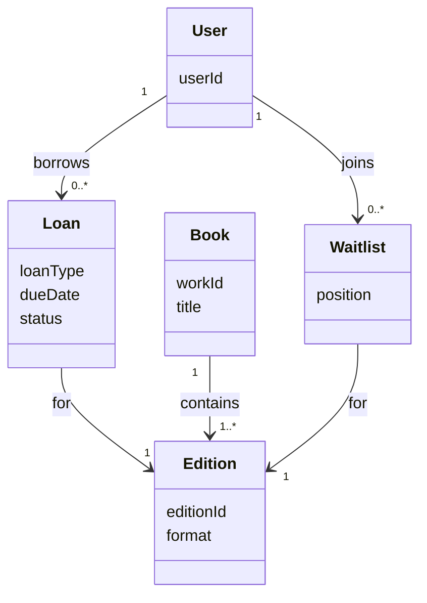
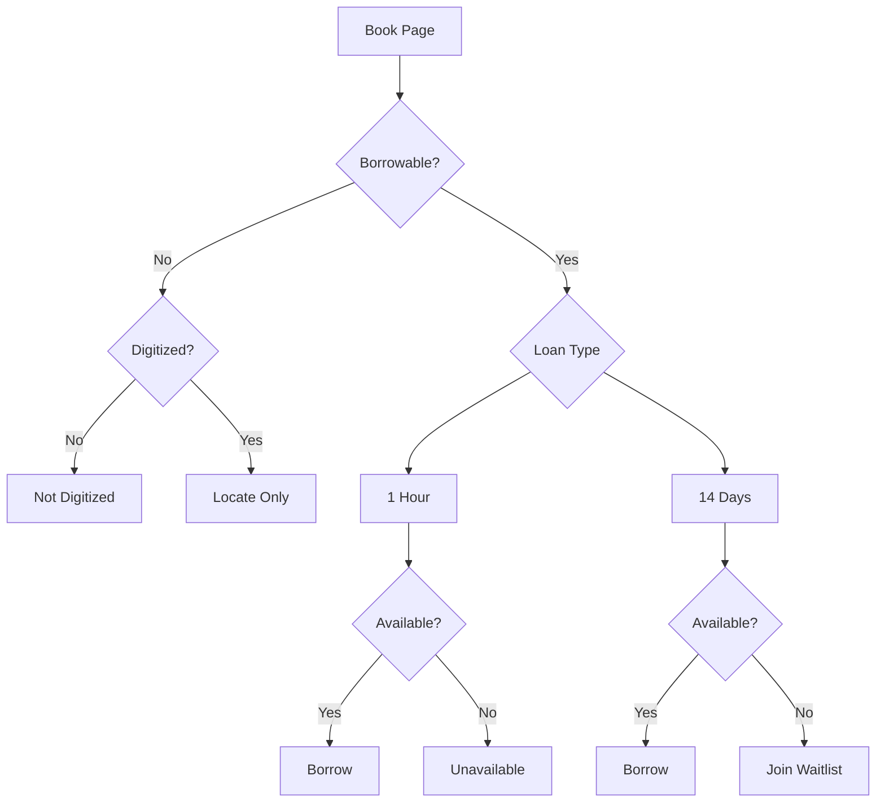

# Research

Diagrams represents understanding using [Borrowing Books Through Open Library](https://openlibrary.org/help/faq/borrow) as source.

| Status | WIP |
|--------|-----|
| Last Updated | 2026-07-18 |
| Source | Borrowing Books Through Open Library |

## Evidence

| Source | Confidence |
|---------|------------|
| Official documentation | High |
| GitHub issues (internetarchive/openlibrary) | High for availability & waitlist friction; not yet checked for device/quality pain points — see [Sources](./sources.md) |
| User reports (Medium, Goodreads) | Medium — two verified sources, not a broad sample |
| Reddit | Not substantiated — could not locate real threads; do not cite until sourced |
| Source code | Not researched |

## Purpose

This document is based on the OpenLibrary documentation and will be continuously updated as additional sources are reviewed. See [Sources](./sources.md) for the linkable evidence backing the findings in this research.

## Domain Understanding

## Borrowing Decision Flow

Splits "not borrowable" into two distinct causes — not digitized vs. readable without borrowing — since they mean opposite things to the user. (See [Decision Log](../decision-log.md#2026-07-18--not-digitized-split-from-read-online) for the correction history.)

**Note:** this diagram models book-level availability only. There's a separate, account-level gate that can interrupt either `Borrow` terminal node (`I` or `K`) at the moment of the click: if the user already has 10 active loans, the borrow fails regardless of the book's availability. Not drawn into this diagram because it's orthogonal to book state, not a branch of it — see [Content & State Model, State 6](../content-state-model.md#6-loan-limit-reached-account-level-not-book-level).

## Assumptions

- Loan types are mutually exclusive per book (confirmed 2026-07-18, see [Content & State Model](../content-state-model.md#two-things-this-model-depends-on)).
- Waitlists are only available for 14-day loans, never for 1-hour-only books (confirmed via official docs).
- "Not digitized" and "borrowable but currently unavailable" are distinct causes with the same visual weight — neither should read as more or less final than it is.

## Open Questions

- Is "Read Online" truly copy-unlimited, or is it a 1-hour CDL loan executing automatically on click, subject to the same copy pool as other 1-hour loans? (Flagged 2026-07-18 — see [Content & State Model, State 1](../content-state-model.md#1-read-online-not-borrowable). Needs a real test before the Not Digitized/Read Online split in the flowchart above can be trusted as final.)
- Can users renew every loan, or only 1-hour ones? (Official docs say 1-hour loans are renewable if copies are available; 14-day loans are not — need to confirm this is still accurate.)
- Are there account-level borrowing limits beyond the 10-book cap? (Out of scope for now — belongs to the parked Manage Library phase.)
