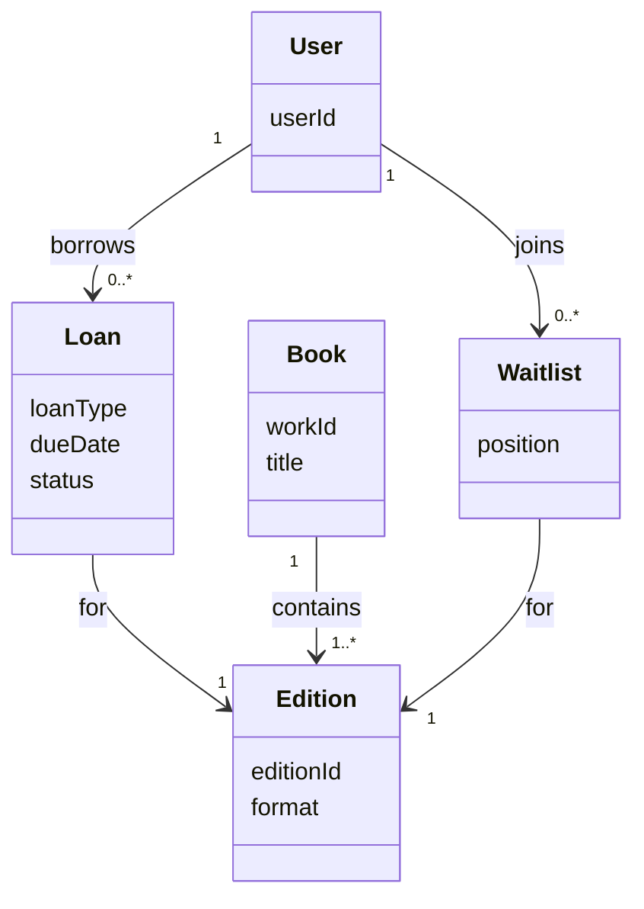
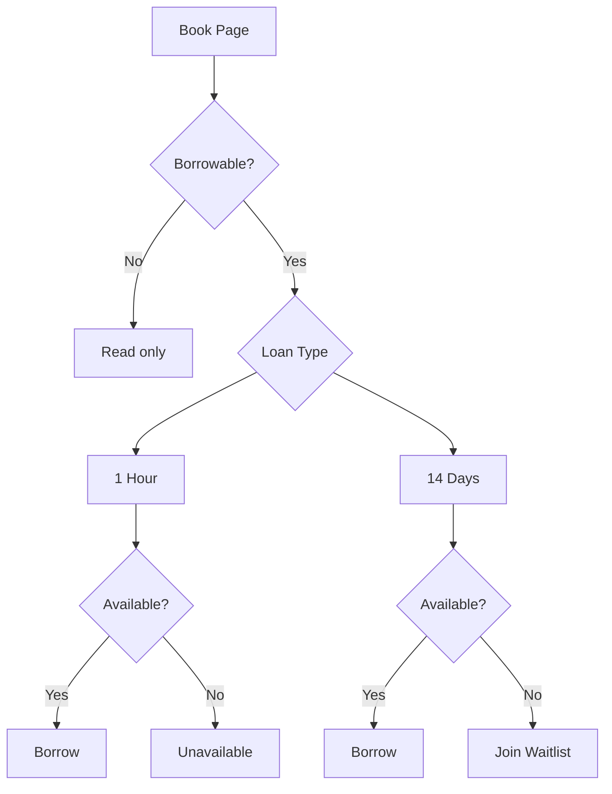

# Research

Diagrams represents understanding using [Borrowing Books Through Open Library](https://openlibrary.org/help/faq/borrow) as source.

| Status | WIP |
|--------|-----|
| Last Updated | 2026-07-16 |
| Source | Borrowing Books Through Open Library |

## Evidence

| Source | Confidence |
|---------|------------|
| Official documentation | High |
| User reports | Not researched |
| GitHub issues | Not researched |
| Source code | Not researched |

## Purpose

This document is based on the OpenLibrary documentation and will be continuously updated as additional sources are reviewed.

## Domain Understanding

## Borrowing Decision Flow

## Assumptions

- Loan types are mutually exclusive.
- Waitlists are only available for some loan types.
- Availability is evaluated after loan type.

## Open Questions

- How do waitlists work?
- Can different editions have different lending states?
- Can users renew every loan?
- Are there account-level borrowing limits?